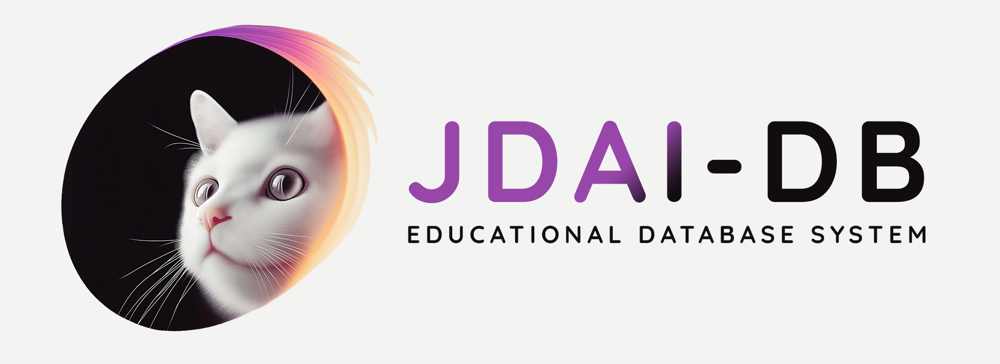

# `jdaidb` - Educational Database Management System in Python



`jdaidb` is an educational database management system written in Python. This system is not ready for production. Please use it at your risk.

This system is based on the great Codd's Relational data model. It is enhanced with the fake LRU-based buffer pool for OLTP-based workloads. This system also supports a subset of SQL-92 with decent implementations of relational operators. This system does not support multiple users at the same time (i.e., concurrent access).

## Trying `jdaidb`
Before we begin, I would suggest you try using `jdaidb` first. To run it, you should go to the driver file (`src/run.py`) or simply type the following command in your terminal.

```
python3 src/run.py
```

You will get a shell interface that you can type anything there (but not everything will be valid). To exit, type `exit`.

The first version of `jdaidb` allows you to do three main things:
- Create a table using a `CREATE TABLE` statement. However, it is not based on the SQL-92 standard. Please check out the `src/test_jdaidb.py` for the precise syntax.
- Insert a row into a table using a `INSERT INTO` statement
- Drop a table using a `DROP TABLE` statement.

## Overview
There are multiple components in `jdaidb` as described below:
- `catalog`: The collection of code maintaining the system catalog for `jdaidb`
- `common`: The collection of utility code (e.g., files)
- `interface`: The collection of code making an interface (e.g., command-line interface)
- `parser`: The collection of code for parsing the SQL statement and executing it
- `query_engine`: The collection of code for executing the parsed SQL statement
- `storage_manager`: The collection of code for managing database storage and buffer pool

## Assignment #1 - Database Storage (Due: January 13th, 2025 11:59 PM)
The first assignment will be on the `storage_manager` component. In short, you will need to implement the `buffer_pool` code and make the `core` code utilizes it.

In order to do so, you will need to understand the code in the `storage_manager` component and other relevant components.

### Part A - Understanding Storage Manager
Firstly, to understand the storage manager, you will need to understand the role of typical storage managers first. We did it in the class, by the way.

The storage manager of `jdaidb` has the following bits and pieces:
- `catalog`: The list of entries describing database objects. Fortunately, the only database object at the moment is a table.
- `page_filepath`: The mapping between a page identifier and its corresponding file path
- `page_directory`: Similarly to Lecture 3. The mapping between a database object identifer (i.e., table name) and its corresponding collection of pages. You should check the file `src/jdaidb/storage_manager/page_directory_entry.py` for more detail.

Other components/variables are more like a facilitator for making this storage manager work.

More importantly, you may see a lot of `flush`, `restore` functions/methods in many files. They are for saving the states of the objects on disk (instead of on memory). Whenever you stop using `jdaidb`, the data will still remain on your machine. You do not need to touch them (unless instructed).

For Part A, you will be tasked to write comments on each function/method. You need to write it in [docstring](https://peps.python.org/pep-0257/) or like

```python
def add(a: int, b: int) -> int:
    """
    Add two integers together and return the sum
    """
    return a + b
```

### Part B - Implementing Buffer Pool
This is probably the hardest part of this assignment. You will need to complete the `src/jdaidb/storage_manager/buffer_pool.py` file by implementing the `BufferPool` class as annotated with `TODO(A1):`. This requires knowledge from Lecture 4.

The buffer pool in `jdaidb` required in this assignment is the buffer pool that can store pages in memory and must be able to evict a page using the [LRU (least-recently used)](https://redis.io/glossary/lru-cache/) policy. Implementing the LRU policy may require additional research (but it is not that hard). However, if you just copy and paste it from external sources, be prepared for the interview.

(Hint: do not use `OrderedDict` as many people on the internet suggested if you do not understand how it works. We do not evaluate you in terms of performance. You only need to use several Python lists to deal with this.)

### Part C - Linking Storage Manager with Buffer Pool
If you look at the `src/jdaidb/storage_manager/core.py` carefully, you will see that there are many `TODO(A1):`. Those positions are where you need to link the original storage manager with the buffer pool. Unless you understand the storage manager and buffer pool code, you will not be able to complete this. To help you, several hints are provided pretty straightforwardly. You can consult with those in order to get this part done.

### Check-Out
Be prepared for your first team check-out. You can start doing check-out on Jan 6. However, I will need to travel during Jan 8 - Jan 9. The check-out will be back around Jan 11 or Jan 12. Please wait for the further announcement on Discord.

## Assignment #2 - Database Index
TBA

### Part A - B+Tree
TBA

### Part B - Hash Table
TBA

## Assignment #3 - Query Engine
TBA

### Part A - SQL Parser
TBA

### Part B - Sequential Scan
TBA

### Part C - Index Scan
TBA

### Part D - Filter
TBA

### Part E - Project
TBA

### Part F - Result
TBA

### Part G - Nested Loop Join
TBA

### Part H - Hash Join
TBA
